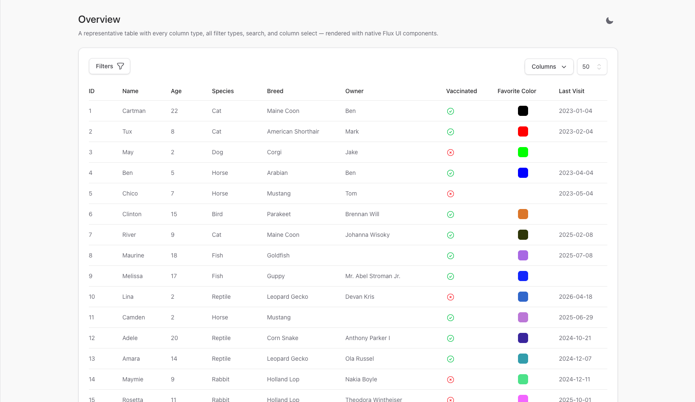
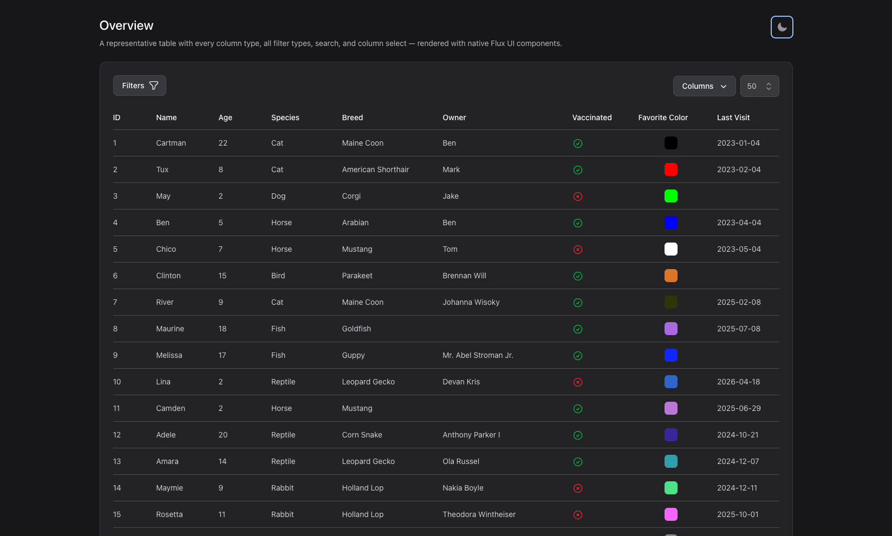

# Theming

The table renders through one of four themes. The theme controls the Blade branch used for every
component view, the CSS classes applied, and — for the Flux theme — which native UI components are
used. Themes are selected globally via config or per component via `setTheme()`.

- `tailwind` — the default.
- `bootstrap-4`
- `bootstrap-5`
- `flux` — new in v4.0, built on [Flux UI](https://fluxui.dev).

## Selecting a theme

Set the default theme in `config/livewire-tables.php`:

```php
'theme' => 'tailwind', // tailwind | bootstrap-4 | bootstrap-5 | flux
```

Or override it per component in `configure()`:

```php
public function configure(): void
{
    $this->setPrimaryKey('id')
        ->setTheme('flux');
}
```

## The Flux theme

The Flux theme renders the table and every control with native [Flux UI](https://fluxui.dev)
components (`flux:table`, `flux:input`, `flux:select`, `flux:switch`, `flux:badge`, and more). It
requires the `livewire/flux` package, which is free and directory-based — no licence key is needed
for the components this theme uses.

The theme is Tailwind-based, so it inherits Tailwind's utility layer and Flux's own zinc palette,
including first-class light and dark modes.





### How theme detection works

Theme detection lives in `src/Views/Traits/Core/HasTheme.php`:

- `isFlux()` returns `true` when the theme is `flux`.
- `isTailwind()` stays `true` for the Flux theme, because the Flux theme is Tailwind-based and reuses
  the Tailwind body branch as its fallback.

Component views branch on `$this->isFlux()`. Filter views (under
`resources/views/components/tools/filters/`) render standalone without `$this`, so they branch on an
`$isFlux` variable threaded through the filter's generic display data.

### Native table vs. fallback

Flux's `flux:table` cannot express every table feature. `HasTheme::useFluxTable()` decides, per
render, whether to use the native `flux:table` body or to fall back to the package's own table markup
styled with Flux's zinc palette. The native path is used only when none of the following is active:

| Feature | Why it forces the fallback |
|---|---|
| Reordering | needs draggable row attributes |
| Clickable row URL | needs per-cell navigation / `href` |
| Bulk actions | needs a checkbox column |
| Collapsing columns | needs responsive `hidden` classes on cells |
| Loading placeholder | injects a non-Flux placeholder row |
| Secondary header (with columns) | needs a second header row |
| Footer (with columns) | needs a `tfoot` row |

The fallback still looks like Flux — it uses the same zinc borders, striping, and dark-mode colours —
but is built on the package's own `table`/`tr`/`td` markup instead of the `flux:table` components.

### Control mapping

On the Flux theme, each control renders as its Flux equivalent:

| Control | Flux component |
|---|---|
| Search box | `flux:input` |
| Per-page selector | `flux:select` |
| Text / number / date / datetime filters | `flux:input` |
| Select filter | `flux:select` |
| Multi-select filter | `flux:checkbox.group` |
| Boolean filter | `flux:switch` |
| Column select | `flux:checkbox` |
| Filter and sorting pills | `flux:badge` + `flux:badge.close` |
| Reset / clear buttons | `flux:button` |
| Empty state | `flux:table` row with an icon badge and heading |
| Pagination | zinc-palette Flux pagination view |

### Dark mode

Dark mode is driven by a `.dark` class on the document, toggled by Flux's appearance system. Dropdown
and popover panels (filters, column select, bulk actions) use the zinc palette with a translucent
hairline border (`ring-zinc-950/10` in light, `dark:ring-white/10` in dark) so their edges stay subtle
and consistent with Flux's own menus.

## Contributor note: Blade gotcha

When editing Flux-theme views, never place `wire:key` or a `{{ }}` / `{!! !!}` echo inside a paired
`<flux:*>` opening tag. Livewire's compiler injects a stray `@endif` for `wire:key` on a component,
which breaks the enclosing `@if`/`@elseif` and fails compilation with "unexpected token elseif". Keep
`wire:key` and `x-data` on a plain wrapper element; self-closing Flux tags tolerate echoes in
attributes. The test suite registers `Flux\FluxServiceProvider` so these compile errors surface in CI
rather than only at runtime.
