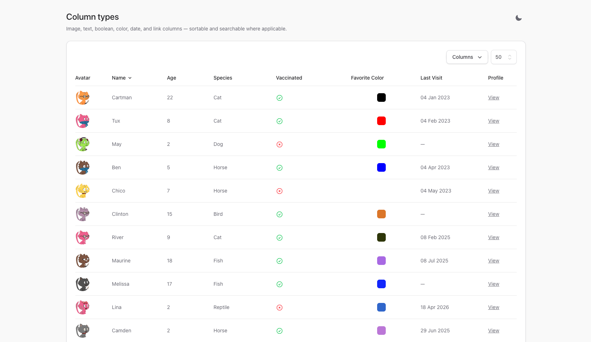
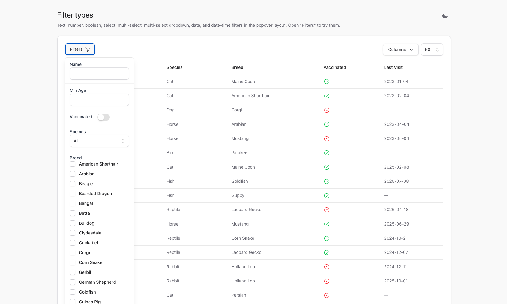
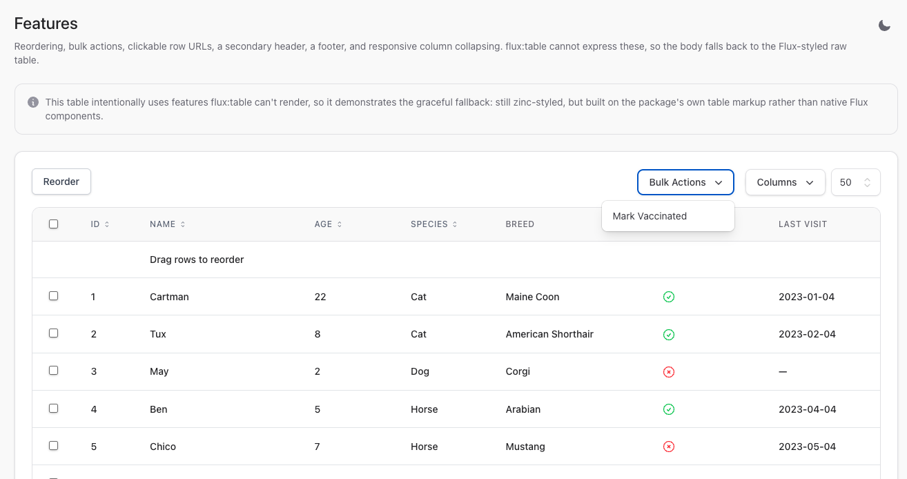

# Workbench

The `workbench/` directory is an [Orchestra Testbench](https://packages.tools/testbench) application
bundled with the package for development only — it is never shipped to consumers. It provides a runnable
showcase of every column type, filter type, and feature across all four supported themes (tailwind,
bootstrap-4, bootstrap-5, and the new flux theme).

The `testbench.yaml` at the repository root registers `Flux\FluxServiceProvider` and sets
`discovers.views: true` so the workbench's Blade pages and the Flux components resolve.

## Running the demo

Serve the demo app together with a Vite watcher (the app on port 8000, Vite rebuilding CSS/JS on change):

```bash
composer serve
```

Under the hood this runs `testbench serve --port=8000` and `npm run dev` concurrently. To serve without
the asset watcher, use the Testbench binary directly:

```bash
vendor/bin/testbench serve
```

Build the CSS bundle once (without watching), for example before taking screenshots:

```bash
npm run build
```

The Vite pipeline is a **workbench-only** concern; it is not part of the shipped package.

## Reseeding the demo database

Rebuild and reseed the demo SQLite database with a fresh migration:

```bash
vendor/bin/testbench migrate:fresh
```

This command **auto-seeds** the seeder configured in `testbench.yaml`
(`Workbench\Database\Seeders\DatabaseSeeder`). Do **not** also run `db:seed` afterwards — that runs the
seeder a second time and fails on a `UNIQUE` constraint violation.

## Demo dataset

The seeder builds its data from Pet and Owner factories and produces:

- 8 species
- 29 breeds
- 44 owners
- ~156 pets, including deliberate null-owner and null-last-visit rows to exercise empty-value rendering

Five named anchor pets — Cartman, Tux, May, Ben, and Chico — are pinned to the top of the table so demos
and screenshots stay deterministic.

## Demo routes

Every page wraps a shared Flux sidebar layout (with a light/dark toggle) and embeds one or more demo
tables.

| Route               | Page              | What it shows                                                         |
| ------------------- | ----------------- | -------------------------------------------------------------------- |
| `/`                 | Overview          | Kitchen-sink table combining columns, filters, search, and paging    |
| `/columns`          | Column types      | Every column type side by side                                       |
| `/filters`          | Filter types      | Every filter type in the Filters popover                             |
| `/features`         | Features          | Reorder, bulk actions, clickable rows, secondary header, footer, collapsing |
| `/pagination`       | Pagination        | Simple, cursor, and none pagination modes                            |
| `/empty`            | Empty state       | The Flux empty state                                                  |
| `/themes/flux`      | Flux theme        | The table rendered with the flux theme only                          |
| `/themes/tailwind`  | Tailwind theme    | The table rendered with the tailwind theme only                      |
| `/themes/bootstrap` | Bootstrap theme   | The table rendered with a Bootstrap theme only                       |

Each `/themes/*` page loads **only** that theme's CSS/JS: the full Tailwind + Flux Vite bundle for the
Flux page, a separate Tailwind-only bundle for the Tailwind page, and Bootstrap from a CDN for the
Bootstrap page — so the global styles of one theme never collide with another on a shared page. Visiting
`/themes` redirects to `/themes/flux`.

## Screenshots

The `/columns` page lays out every column type so you can compare their rendering at a glance.



The `/filters` page exposes each filter type; the screenshot below has the Filters popover open.



The `/features` page turns on reordering and bulk actions, which forces the package to render its
Flux-styled fallback table (the native `flux:table` body cannot preserve those behaviours).


